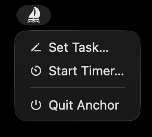
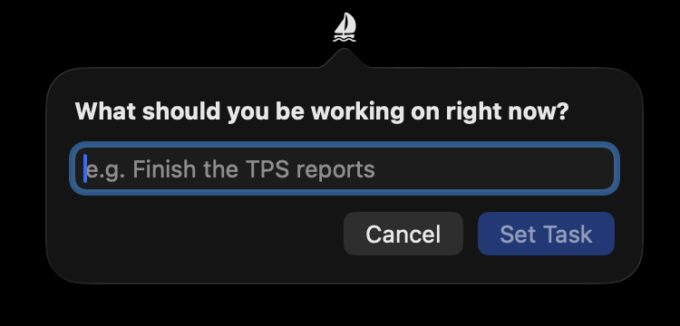
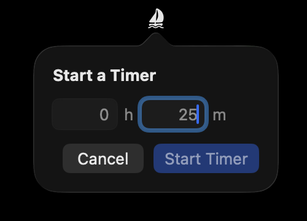

# Anchor

A simple ADHD-friendly Mac app to help anchor you to your current task.

Anchor puts an icon in your menu bar that lets you set a current task and/or timer, and it then shows the task and/or time in your menu bar. That's it. That's intentionally all it does. Anchor is not a task manager, a time tracker, or your mom. It can't save you from yourself. But it can help you remember that you _need_ saving from yourself.

## Screenshots

### Setting a task and timer

<table>
    <td></img></td>
    <td></img></td>
    <td></img></td>
</table>

### Menu bar showing an active task and/or timer

<table>
    <td></img></td>
    <td></img></td>
    <td></img></td>
</table>
